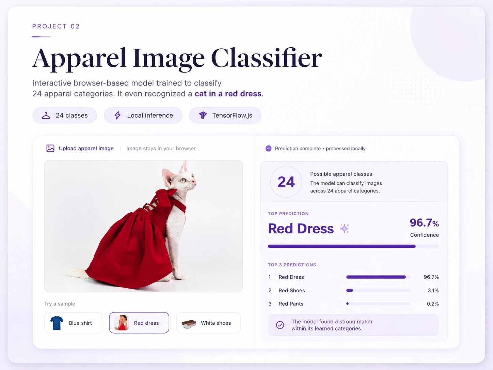
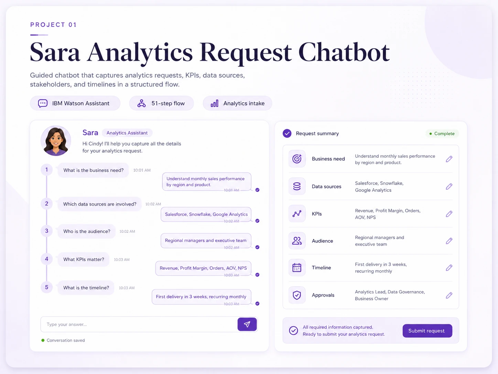

<!DOCTYPE html>
<html lang="en">
<head>
  <meta charset="UTF-8" />
  <meta name="viewport" content="width=device-width, initial-scale=1.0" />

  <meta
    name="description"
    content="Cindy Mendoza — Analytics Manager working across data, business intelligence, data products, and artificial intelligence."
  />

  <title>Cindy Mendoza | Analytics Manager</title>

  
</head>

<body>
  <header class="site-header">
    

      <a class="brand" href="#top">Cindy Mendoza</a>

      <nav class="nav-links" aria-label="Main navigation">
        <a href="#about">About</a>
        <a href="#portfolio">Portfolio</a>
        <a
          href="https://github.com/Cindylmm95"
          target="_blank"
          rel="noreferrer"
        >
          GitHub
        </a>
      </nav>
    

  </header>

  <main id="top">
    <section class="hero">
      

        
Analytics Manager · Data, AI & Analytics Products

        <h1>
          If it challenges me,
          it is probably worth doing.
        </h1>

        

          I am <strong>Cindy Mendoza</strong>. I build analytics solutions that
          connect data, technology, business needs, and the people who actually
          use them. I enjoy projects that require me to learn, question the
          obvious, and turn complexity into something useful.
        

        

          <a class="button" href="#about">Get to know my work</a>
          <a
            class="button secondary"
            href="https://github.com/Cindylmm95"
            target="_blank"
            rel="noreferrer"
          >
            Visit GitHub
          </a>
        

      

    </section>

    <section class="container experience-strip" aria-label="Experience">
      <article class="experience-item">
        
          7+
        
        Years in data and analytics
      </article>

      <article class="experience-item">
        
          3+
        
        Years leading analytics teams
      </article>
    </section>

    <section class="section" id="about">
      

        

          <h2>Data is technical. Making it useful is human.</h2>
          

            My work sits between analytics, product thinking, business
            strategy, and user experience.
          

        

        

          <article class="panel">
            

              

                

                  
                

                

                  Hi, I’m Cindy! Welcome to my portfolio.
                

              

              

                

                  I have worked on business intelligence, customer analytics,
                  reporting automation, data products, and AI projects. I am
                  curious by nature and love experimenting with technologies to
                  learn what they can really do in practice. I am especially
                  interested in building solutions that are not only technically
                  sound, but also understandable, maintainable, and useful in
                  real decisions. Check my portfolio to see some of my latest
                  experiments.
                

              

            

          </article>

          <aside class="panel facts" aria-label="Education">
            

              Completed
              
                Bachelor’s in Biomedical Engineering
              
            

            

              Completed
              
                Master’s in Customer Analytics and Digital Marketing
              
            

            

              Currently studying
              
                Master’s in Artificial Intelligence
              
            

          </aside>
        

      

    </section>

    <section class="section" aria-labelledby="impact-title">
      

        

          <h2 id="impact-title">Experience across teams and regions</h2>
        

        

          <article class="achievement">
            Global programs
            

              Supported analytics programs used across global business teams.
            

          </article>

          <article class="achievement">
            Leadership
            

              Led analytics initiatives across AMER, EMEA, and APAC.
            

          </article>
        

      

    </section>

    <section class="section" id="portfolio">
      

        

          <h2>Projects</h2>
          

            Interactive work where analytics, artificial intelligence, and
            practical problem solving come together.
          

        

        

          <article class="project-card">
            

            

              Computer Vision
              <h3>Apparel Image Classifier</h3>
              

                Trained and optimized a model to classify 24 apparel categories,
                then deployed it for local browser predictions. It even identified
                a cat wearing a red dress with 96.7% confidence.
              

              

                TensorFlow
                Transfer Learning
                TensorFlow.js
              

              

                <a
                  class="project-link"
                  href="https://cindylmm95.github.io/apparel-image-classifier/"
                  target="_blank"
                  rel="noreferrer"
                >
                  Try live project ↗
                </a>
                <a
                  class="project-link secondary"
                  href="https://github.com/Cindylmm95/apparel-image-classifier"
                  target="_blank"
                  rel="noreferrer"
                >
                  View code ↗
                </a>
              

            

          </article>

          <article class="project-card">
            

            

              Task Optimization
              <h3>Sara Analytics Request Chatbot</h3>
              

                Designed a guided chatbot that turns an informal analytics request
                into a structured intake by capturing business needs, data sources,
                KPIs, audience, timeline, and approvals.
              

              

                IBM Watson Assistant
                Conversation Design
                Workflow Optimization
              

              

                <a
                  class="project-link"
                  href="https://cindylmm95.github.io/my-analytics-request/"
                  target="_blank"
                  rel="noreferrer"
                >
                  Try live project ↗
                </a>
                <a
                  class="project-link secondary"
                  href="https://github.com/Cindylmm95/my-analytics-request"
                  target="_blank"
                  rel="noreferrer"
                >
                  View code ↗
                </a>
              

            

          </article>
        

      

    </section>

    <section class="section" aria-labelledby="expertise-title">
      

        

          <h2 id="expertise-title">What I work with</h2>
        

        

          Analytics Leadership
          Data Strategy
          Business Intelligence
          Analytics Products
          Customer Analytics
          Applied AI
          SQL
          Python
          Databricks
          Power BI
          Adobe Analytics
          Salesforce
        

      

    </section>
  </main>

  <footer>
    

      ©  Cindy Mendoza
      Curious by nature. Analytical by practice.
    

  </footer>

  
</body>
</html>
